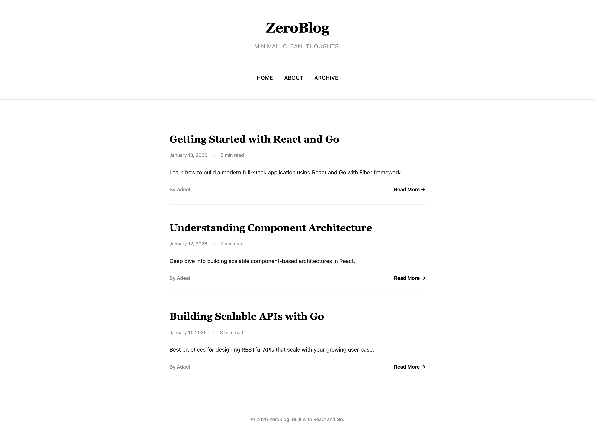

# ZeroBlog



## About

ZeroBlog is a minimal, elegant blogging platform built with **Go** and **React**. It's a modern full-stack project that combines the speed and efficiency of Go's Fiber web framework with React's component-based frontend.

## What You're Building

A multi-tenant blog system with:
- Clean, minimalist black and white design
- Role-based access control (RBAC) per tenant
- Fast server-side rendering with Go
- Responsive React frontend
- Component-based architecture

## Quick Start

**Build frontend:**
```bash
npm run dev
```

**Run dev server with auto-reload:**
```bash
CompileDaemon -command="go run main.go" -exclude-dir=frontend,node_modules,public,views
```

That's it! Visit `http://localhost:3000`
